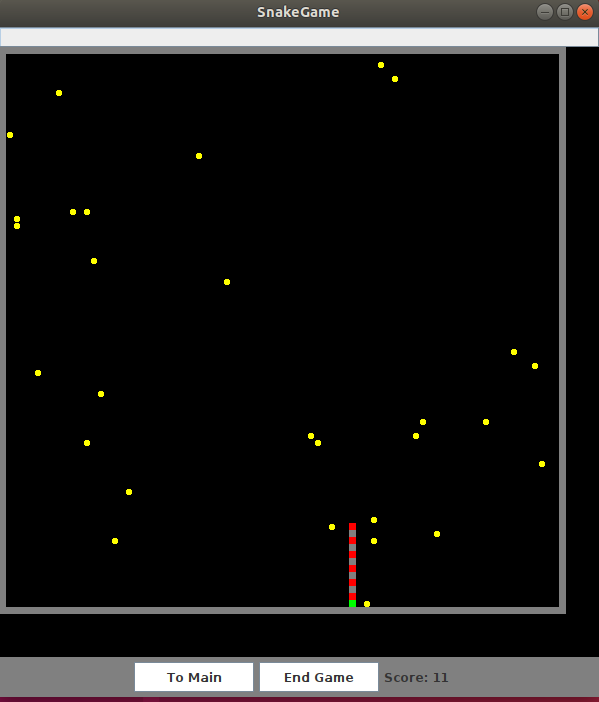
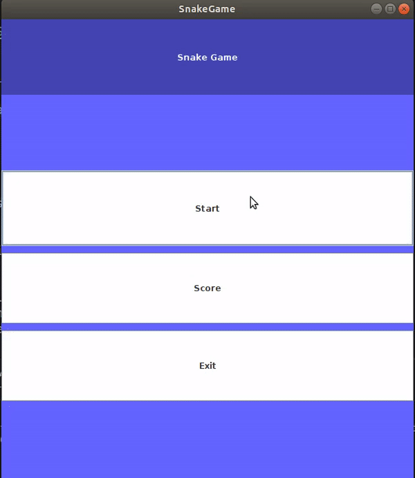
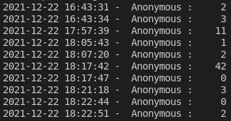

<!-- PROJECT SHIELDS -->
<!--
*** I'm using markdown "reference style" links for readability.
*** Reference links are enclosed in brackets [ ] instead of parentheses ( ).
*** See the bottom of this document for the declaration of the reference variables
*** for contributors-url, forks-url, etc. This is an optional, concise syntax you may use.
*** https://www.markdownguide.org/basic-syntax/#reference-style-links
-->

[![Forks][forks-shield]][forks-url]
[![Stargazers][stars-shield]][stars-url]
[![Issues][issues-shield]][issues-url]

<!-- PROJECT LOGO -->
 

 
  
Game screen

  

   
   

<h3 align="center">Snake Game</h3>

  

    A basic snake game program with progress load & save
     
     
    <a href="https://github.com/MarcoBackman/Snake-Game/#demo-videos">View Demo</a>
    ·
    <a href="https://github.com/MarcoBackman/Snake-Game/issues">Report Bug</a>
    ·
    <a href="https://github.com/MarcoBackman/Snake-Game/issues">Request Feature</a>
  

 
 

<!-- ABOUT THE PROJECT -->
## About The Project

A simple snake game app in java

There are currently 6 features implemented.

1. User can use arrow keys to move the snake
2. User can see previous scores
3. User can continue game from the previous play, or can decide to play new game
4. Snake gets faster every 10 eat, also reduces the amount of apple to eat

For initial start, snake usually starts at the middle.
Snake cannot move in reverse direction, because the snake cannot eat itself.

## Demo image and video

  
Video

  

   
   

  
Screen_board

  

(<a href="#top">back to top</a>)

 

### Built With

* [Java JRE 15.0.1](https://www.java.com/en/)

 
 

<!-- GETTING STARTED -->
## How to run?

Java jre must be installed first, please download newest java from [here](https://www.java.com/en/)
In oder to execute the program, please download the file by forking this repository. Or you can download a zipfile from above tab.

 

### Prerequisites

Data files are version sensitive, app version mismatch will cause error on data load.

<!-- USAGE EXAMPLES -->
## Usage

Entertainment

<!-- CONTACT -->
## Contact

Marco Backman - roni2006@hanmail.net

(<a href="#top">back to top</a>)

<!-- MARKDOWN LINKS & IMAGES -->
<!-- https://www.markdownguide.org/basic-syntax/#reference-style-links -->
[forks-shield]: https://img.shields.io/github/forks/MarcoBackman/Snake-Game.svg?style=for-the-badge
[forks-url]: https://github.com/MarcoBackman/Snake-Game/network/members
[stars-shield]: https://img.shields.io/github/stars/MarcoBackman/Snake-Game.svg?style=for-the-badge
[stars-url]: https://github.com/MarcoBackman/Snake-Game/stargazers
[issues-shield]: https://img.shields.io/github/issues/MarcoBackman/Snake-Game.svg?style=for-the-badge
[issues-url]: https://github.com/MarcoBackman/Snake-Game/issues
